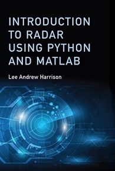

# Ordering Information

## Artech House Publisher
ISBN: 9781630815974 

Copyright: 2019

[Order Now](https://us.artechhouse.com/Introduction-to-Radar-Using-Python-and-MATLAB-P2051.aspx)

 &nbsp; &nbsp; &nbsp; 

## Python®

The Python tools were developed with version 3.6.4 and the GUIs were developed with Qt 5.10.0.  The  tool  suite  makes  use  of  packages  including  SciPy,  NumPy and  Matplotlib. To install Python and the necessary packages, begin by navigating to [Python](http://python.org) and downloading the installer for the operating system of choice. Launch the Python installer and follow the onscreen instructions. Once the installation iscomplete, ensure the following packages are installed by typing the following commands at the command prompt:

```markdown
> pip install numpy
> pip install scipy
> pip install matplotlib
> pip install pyqt5
> pip install -e mypath/pyradar
```
Where **mypath** is the path to the folder 'pyradar'.

## MATLAB®

The MATLAB scripts associated with this  text  were  developed  with  R2018a  and  do  not  require  any  additional  toolboxes. The folder structure for the MATLAB and Python scripts is identical.  In  order  to  run  the  MATLAB scripts  provided  with  this  text,  the  library  folder  and subfolders must be added to the MATLAB path. Once these folders have been added, the MATLAB scripts may be executed from the editor or from the command window by typing the name of the script.  For more information on MATLAB visit [MathWorks®](https://www.mathworks.com/).
